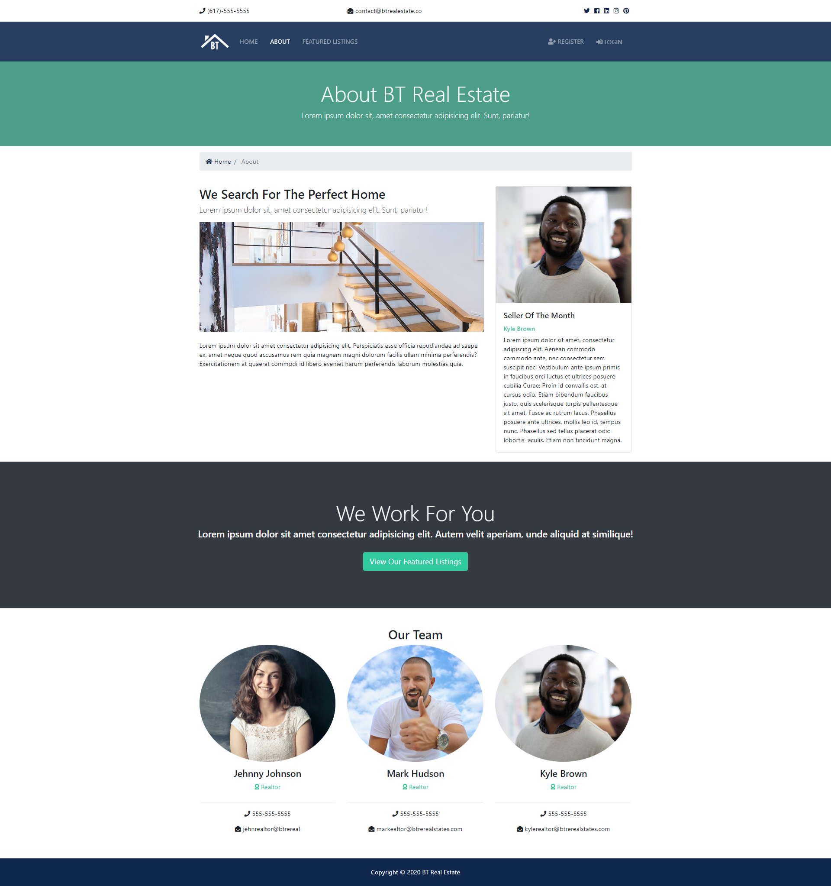
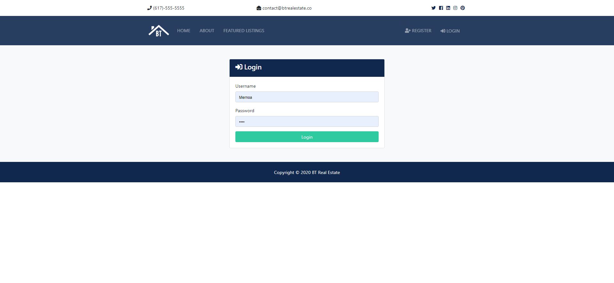
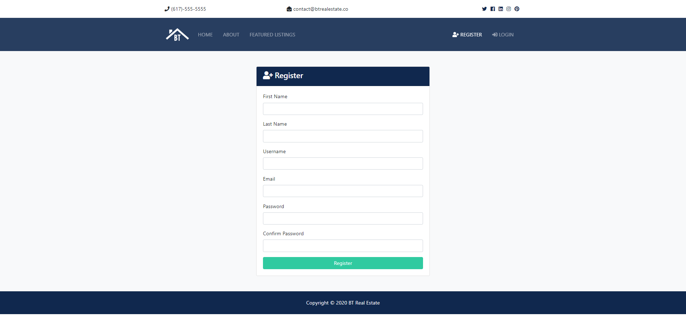
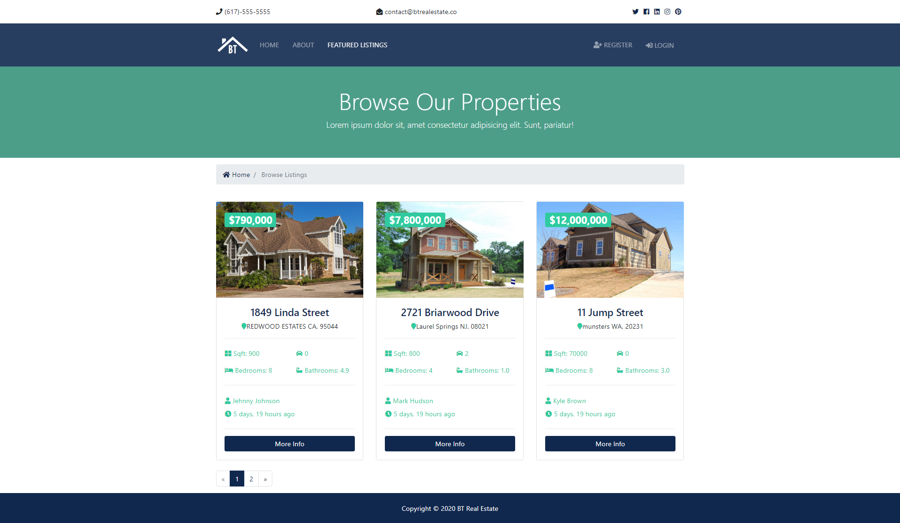

# Python_Real_State
Proyect based on course but modfied to try new things with it

Steps to run the site on local:
 - Install django
 - Run:
    1 - source ./venv/bin/activate
    2 - python manage.py runserver
    3 - go to localhost 8000

